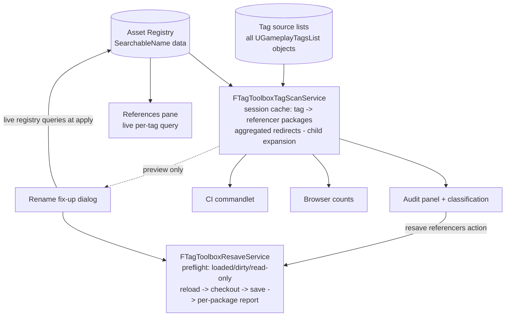
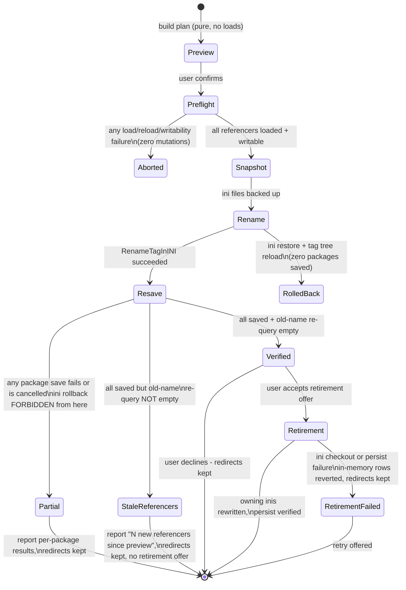

# feat: Tag Toolbox v0.2 — sees debt, pays debt, never regresses

**Target repo:** TagToolbox (the LostRadiance submodule at `Plugins/TagToolbox`). All paths below are relative to the plugin repo root. Builds and tests run through the LostRadiance host per `CLAUDE.md`.

## Summary

Turn the v0.1 audit from a report into a cleanup workflow: rename-with-asset-fixup, audit actions (delete unused / create redirect / resave referencers), usage counts in the Browser, and a CI commandlet that fails builds on referenced-but-undefined tags — plus two picker parity gaps (inline tag creation, pill copy/paste) created when the plugin replaced the engine widgets.

---

## Problem Frame

v0.1 shipped the *seeing* half: the audit names unused, undefined, near-duplicate, and redirect-lingering tags, and the Browser answers "who uses this tag" instantly. But nothing in the engine or the plugin *fixes* any of it — the engine's own tag rename writes a redirect and never resaves a single referencing asset (open Epic issue UE-194640), deleting tags is manual ini surgery, and CI has no guard against content silently referencing a deleted tag (a shipped-bug class).

Two self-inflicted gaps ride along: because the plugin's picker replaced the engine dropdown, designers lost the engine's inline "create new tag" flow and the chip's copy/paste — parity debts this release repays.

Research has already verified every engine seam this plan depends on (see Sources), including the previously unknown one: programmatic package resave is dialog-free and source-control-safe by construction via the UnrealEd file helpers.

---

## Requirements

**Picker parity**

- R1. When the picker's search text matches no tag in the **full tag table** (not merely the filtered tree), an inline create row offers to create it — gated on the property being editable and `ShouldImportTagsFromINI()`, validating through the engine's tag-string validation with its fixed-string suggestion surfaced.
- R2. A created tag is committed (selection mode) or revealed (browse mode) even if the menu host is dismissed mid-creation, and the search state resets so the row never re-offers a tag that now exists.
- R3. The tag pill supports copy (plain tag string) and paste (plain names and engine export text) using the engine-identical transaction and write shape; unusable clipboard content is refused with a notification — never silently dropped.

**Rename and fix-up**

- R4. A rename dialog (reachable from Browser row context and audit lingering-redirect rows) wraps the engine rename including subtree semantics, and previews before any mutation: every referencing package of the whole renamed subtree (child names expanded from a pre-rename snapshot), each package's dirty/loaded/read-only status, and the un-fixable reference stores (Blueprint `Categories` metadata, C++ literals, config strings) named explicitly.
- R5. Apply is three-phase — preflight (load/reload every referencer, verify writability), snapshot (every ini the rename touches), apply — with the state-machine rule: **ini rollback is permitted if and only if zero packages have saved**. Partial failure keeps all redirects and reports exact per-package outcomes.
- R6. Redirect retirement is offered only after a clean resave AND a re-query of the old names (including chain-reachable names) confirms zero remaining referencers; retirement removes rows from the redirect's **owning** tag-source list.
- R7. Plugin-owned tag-name stores (style registry entries, favorites, recents) are fixed up in the same apply.

**Audit actions**

- R8. The audit list is multi-select and gains three explicit actions: Delete selected unused tags (with per-tag refusal reporting), Create redirect… for undefined tags (single-row — one target per old name; target must be defined, not itself a redirect old-name, deduped against the aggregated redirect set), and Resave referencers for lingering redirects (via the shared resave service).
- R9. Audit results show a "results stale — re-run" banner after any tag-table mutation from any surface; refresh and re-scan never mutate anything.
- R10. Redirect collection aggregates across **all** tag source lists, not just `UGameplayTagsSettings` — fixing the v0.1 blind spot that the rename feature would otherwise trip (the engine writes rename redirects to the old tag's source list).

**Usage counts**

- R11. Browser rows show usage counts from the explicit, session-cached scan with three visually distinct states — a number, "not scanned", and "stale since scan" — plus a sort-by-usage lens; the tooltip states the count semantics (exact-name) and the unsaved-edits caveat.

**CI gate**

- R12. A read-only commandlet emits a schema-versioned JSON report; a wrapper script takes its verdict from the report (never the process exit) with fail-closed freshness checks; exit contract 0 = clean, 1 = findings at failure severity (default: referenced-but-undefined only; flags escalate other categories), 2 = infrastructure failure.
- R13. The commandlet consumes the exact same scan and classification code as the editor audit — one implementation, two projections.

**Release and docs**

- R14. `v0.1.0` is tagged on the current state before feature work; the v0.2.0 release moves `.uplugin` version and changelog heading in one commit; designer guide, architecture doc, and the plugin backlog reflect the shipped state.

---

## Key Technical Decisions

- **Build the create row in-plugin over the public `AddNewGameplayTagToINI`**: the engine's `SAddNewGameplayTagWidget` lives in an `Internal/` include scope that project plugins cannot reach (verified against UBT source). The engine function owns validation, source defaulting, checkout, notifications, and the tree refresh — the row is thin UI over it.
- **Commit-survives-menu-death by construction**: capture the commit delegate and the final (fixed) tag name *before* calling the engine create function, and run the commit through the captured delegate after the tree refresh — the ini checkout can steal focus and dismiss the menu host mid-create, and the flow must not depend on the picker widget surviving.
- **Create-vs-filter policy**: in a filtered picker, an out-of-filter name is offered as a filter-root-prefixed suggestion; creating a bare out-of-filter tag from that surface is refused with the reason shown. (Creating a value the property can never hold, from the property's own picker, is a footgun rather than a feature.)
- **Paste policy**: the single-tag pill accepts exactly one tag (plain or export form); container-shaped clipboard against the pill is refused with a notification. A pasted tag outside the property's resolved filter is refused, mirroring the create policy. The engine's import helpers are Private — reimplement the ~15-line `ExportText`/`ImportText` wrappers locally.
- **Resave through the UnrealEd file helpers**: `FEditorFileUtils::PromptForCheckoutAndSave` with `bCheckDirty=false, bPromptToSave=false` and the `OutFailedPackages` param (per-package failure reporting) and auto-checkout — no source-control plumbing of our own. In an INTERACTIVE session the engine's unattended guard does not apply: a failed package save raises the engine's per-package Cancel/Retry/Continue modal, and Cancel mid-batch aborts the remaining saves (`PR_Cancelled` → the Partial outcome). Because `OutFailedPackages` does not enumerate unattempted packages after a mid-batch Cancel, saved-vs-unattempted attribution — and the "rollback permitted iff zero saves" flag — comes from a batch-scoped `UPackage::PackageSavedWithContextEvent` subscription, never from the API outputs alone. Referencer packages already loaded in memory hold the OLD tag name and must be reloaded (`UPackageTools::ReloadPackages`, explicit non-interactive interaction mode so no engine modal fires mid-apply) before resave, else they write the old name back; an opted-in DIRTY package is saved FIRST (capturing the user's edits — the old name it serializes is covered by the redirect), then reloaded, then resaved (behavior pinned in U2).
- **One shared scan service, one shared resave service**: the audit, Browser counts, rename fix-up, and the commandlet all consume `FTagToolboxTagScanService` (session-cached forward walk + aggregated redirects + child expansion); the Browser's References pane deliberately keeps its own live single-tag Asset Registry query (child-inclusive, always current — the difference U9's tooltip documents), so it is NOT a scan-service consumer. Rename fix-up and the audit's resave action share `FTagToolboxResaveService` (one dirty-consent rule, one failure-report shape). The rename flow queries the registry live at apply time — never the session cache.
- **Redirect retirement mirrors engine writes — with an outcome contract the engine lacks**: there is no public redirect-deletion API; retirement removes rows from the owning `UGameplayTagsList::GameplayTagRedirects` and persists via `TryUpdateDefaultConfigFile`, the same shape the engine's own module-internal deletion uses. Each collected redirect record carries its owning source so retirement edits the right file. Retirement and U8's create-redirect share one helper with an explicit outcome contract: writability/checkout check on the owning ini BEFORE mutating the array, `TryUpdateDefaultConfigFile` return value verified, and on persist failure the in-memory rows are reverted with a failure notification — the engine's own shape ignores the return value, silently diverging memory from disk so the redirect resurrects next session.
- **Commandlet mirrors the Paper2DPlus validate-gate contract** (schema field from day one, deterministic ordering, report-is-the-verdict wrapper with fail-closed freshness, 0/1/2 exits) while deliberately dropping its adapter registry — the audit's pure classifiers are the single engine.
- **Version seam**: tag `v0.1.0` now (the `.uplugin` already says 0.1.0; the changelog's Unreleased section becomes the 0.1.0 section), then open `## Unreleased — targeting v0.2.0`. The 0.2.0 version-move commit closes the release (one-commit rule).
- **Counts render three states, never a bare zero for unknown**: an unscanned or stale count displayed as `0` invites deleting a live tag on wrong data.

---

## High-Level Technical Design

Shared services and their consumers — the structural change of this release is that four surfaces converge on two services instead of each re-walking the registry:

The rename apply is a one-way state machine; the load-bearing rule is where rollback dies:

---

## Scope Boundaries

### Deferred to Follow-Up Work

- Container-strip paste and inline creation from the container picker (the engine picker hosted there already offers add-tag; revisit after U4 proves the row).
- Find-in-Blueprint deep-jump from the References pane; function-parameter filters; dimension/exclusivity rules; governance features; query builder — all remain on the plugin backlog (TASK-1 candidates beyond this release).
- Cross-version 5.0–5.7 gates (plugin TASK-2) — this release stays 5.8-only; new version-sensitive seams (FileHelpers entry points, redirect list semantics) get recorded in the TASK-2 gate table as they're touched.
- In-editor fix-up of Blueprint `Categories` metadata during rename (rename names it as un-fixable in the dialog; automating it means editing Blueprints' variable metadata across the project — its own plan).

---

## Implementation Units

### Phase A — Foundations

### U1. Release v0.1.0 and open the v0.2.0 window

- **Goal:** Clean version seam before feature commits: the shipped v0.1 feature set becomes a tagged release.
- **Requirements:** R14 (first half)
- **Dependencies:** none
- **Files:** `CHANGELOG.md`
- **Approach:** Rename `## Unreleased — targeting v0.1.0` to a dated `## v0.1.0` section (the `.uplugin` already carries 0.1.0), open `## Unreleased — targeting v0.2.0`, commit, tag `v0.1.0`, push with the tag.
- **Test scenarios:** Test expectation: none — release bookkeeping only.
- **Verification:** `git tag` shows v0.1.0 on the pushed commit; changelog has exactly one Unreleased heading targeting v0.2.0.

### U2. Engine-behavior characterization

- **Goal:** Pin the engine behaviors the destructive flows' preflight rules depend on, so U6–U8 build on facts rather than assumptions.
- **Requirements:** supports R4, R5, R8
- **Dependencies:** none
- **Files:** `docs/architecture.md` (findings recorded under Verified engine seams)
- **Approach:** In the live host editor with throwaway tags/assets, characterize: (1) `AddNewGameplayTagToINI` on an already-defined tag (exact failure surface); (2) `RenameTagInINI` onto an existing tag and onto its own descendant (merge/cycle behavior); (3) `DeleteTagsFromINI` on a parent with defined children; (4) whether resaving an already-loaded referencer serializes the old or redirected name, whether `UPackageTools::ReloadPackages` before save fixes it, and what reloading a DIRTY package does under a non-interactive interaction mode (U6's save-first ordering depends on it); (5) `RenameTagInINI` re-run on an already-renamed tag (old name undefined) — expected to duplicate the redirect into the settings list via the engine's settings-only `DeleteTagRedirector` + settings fallback, which is why U7's plan phase must branch to skip-to-resave instead of re-renaming; (6) the rollback probe: after `RenameTagInINI`, restore the ini snapshot, reload the tag config, refresh the tree, and check whether `RequestGameplayTag(old name)` still redirects — this probe IS U7's "cannot be fully reconciled" detection. Also check whether `FGameplayTagQuery` properties mark searchable names (fix-up blind-spot wording depends on it).
- **Test scenarios:** Test expectation: none — characterization; the findings become preflight rules asserted by U6–U8 tests.
- **Verification:** architecture.md records all seven findings with the probe method; U6/U7/U8 approaches reference them.

### U3. Shared tag scan service and redirect aggregation

- **Goal:** Extract the audit's registry walk into a session-cached service every surface shares, and fix the redirect blind spot.
- **Requirements:** R10, R13; foundation for R11
- **Dependencies:** none (parallel with U1/U2)
- **Files:** `Source/TagToolboxEditor/Private/TagToolboxTagScanService.h` (new), `Source/TagToolboxEditor/Private/TagToolboxTagScanService.cpp` (new), `Source/TagToolboxEditor/Private/TagToolboxAudit.h`, `Source/TagToolboxEditor/Private/TagToolboxAudit.cpp`, `Source/TagToolboxEditor/Private/Tests/TagToolboxEditorTest.cpp`
- **Approach:** Service owns: the forward SearchableName walk (`tag → referencer packages`), redirect collection aggregated across every `UGameplayTagsList` (each record carrying its owning source object for later retirement), a child-name-expansion helper over a supplied tag-table snapshot, cache states (fresh / stale / never-scanned) invalidated on `OnEditorRefreshGameplayTagTree` and package saves, and a no-dialog mode for commandlet use (slow-task dialog only in interactive contexts). `RunAudit` becomes a consumer; the pure classifiers stay put and untouched.
- **Patterns to follow:** the existing walk in `TagToolboxAudit.cpp` (RunAudit's package enumeration); the validation-service "one engine, many projections" convention from the host's Paper2DPlus.
- **Test scenarios:** redirect aggregation sees entries from a second (non-settings) source list; each aggregated record resolves its owning list; child expansion over a snapshot returns exactly the subtree names (and is unaffected by post-snapshot table changes); cache state transitions fresh→stale on invalidation without auto-rescan; classification outputs are byte-identical to v0.1 for a fixture with settings-only redirects.
- **Verification:** existing audit behavior unchanged in the editor; new tests green headless.

### Phase B — Picker parity

### U4. Inline create-tag row in the picker

- **Goal:** Restore engine parity: type a missing tag, create it in place, and have it committed/revealed — safely inside a menu host.
- **Requirements:** R1, R2
- **Dependencies:** U2 (existing-tag failure surface)
- **Files:** `Source/TagToolboxEditor/Private/STagToolboxTagPicker.h`, `Source/TagToolboxEditor/Private/STagToolboxTagPicker.cpp`, `Source/TagToolboxEditor/Private/TagToolboxTagPillCustomization.h`, `Source/TagToolboxEditor/Private/TagToolboxTagPillCustomization.cpp`, `Source/TagToolboxEditor/Private/Tests/TagToolboxEditorTest.cpp`
- **Approach:** Row appears between the controls row and the tree (mirroring the engine's slot) when the trimmed search matches nothing in the **full table**. Any non-empty input that fails validation renders the row DISABLED carrying the specific reason — the R3 "never silently dropped" principle applied to creation; empty/whitespace-only input shows no row (nothing was typed). A tag that exists but is hidden distinguishes its cause: hidden by the soft favorites lens → the row is CLICKABLE and routes through `SelectAndRevealTag` (which already clears the lens and search); blocked by the property's hard Categories filter → non-actionable, message naming the filter. Validation runs the engine's string check and offers its fixed suggestion; filtered pickers offer the filter-root-prefixed name per the KTD. The "property editable" gate is plumbed from the pill: a new `CanCreateTags` picker argument set from `StructPropertyHandle->IsEditConst()` (browse mode passes true and gates on `ShouldImportTagsFromINI()` alone). The creation plan (final name, target commit) is captured as a pure struct before calling `AddNewGameplayTagToINI`; post-refresh commit/reveal runs from the captured plan one tick after the tree rebuild, and the search box is set to the created name. Guard double-fire (disable the row while a create is in flight); the in-flight flag clears immediately when `AddNewGameplayTagToINI` returns false (row re-enabled, engine reason surfaced) and clears-with-warning if no tree refresh arrives within a bounded tick budget, so a failed create never leaves the row latched dead.
- **Patterns to follow:** `SelectAndRevealTag` and `CommitSelectedTag` as the post-create primitives; `HandleTagTreeChanged`'s clear-selection-then-rebuild discipline; the one-tick deferral rule.
- **Test scenarios:** (pure seam) create-plan construction: exact-duplicate → no row; favorites-hidden duplicate → clickable reveal state; Categories-blocked duplicate → non-actionable blocked state; whitespace-only input → no row; dots-only / comma-bearing / otherwise-invalid input → disabled row carrying the specific reason; fixed-string divergence → plan carries the fixed name and the search-reset value; filter-root prefixing applied for out-of-filter input; double-fire second plan refused while first is in flight; a failed engine create resets the in-flight state (row re-enabled). (widget) row gated invisible when `ShouldImportTagsFromINI()` is false — with a visible disabled-reason variant decided in implementation; no editor-opening tests without the `CanEverRender` guard.
- **Verification:** live editor: create from an unfiltered browse tab; create from a filtered property dropdown (prefix flow); dismissal mid-create still commits; created tag appears selected with search reset.

### U5. Pill copy/paste

- **Goal:** Clipboard parity with the engine chip on the single-tag pill.
- **Requirements:** R3
- **Dependencies:** none
- **Files:** `Source/TagToolboxEditor/Private/TagToolboxTagClipboard.h` (new — pure export/import helpers), `Source/TagToolboxEditor/Private/TagToolboxTagClipboard.cpp` (new), `Source/TagToolboxEditor/Private/TagToolboxTagPillCustomization.h`, `Source/TagToolboxEditor/Private/TagToolboxTagPillCustomization.cpp`, `Source/TagToolboxEditor/Private/Tests/TagToolboxEditorTest.cpp`
- **Approach:** Copy/paste wired through `FDetailWidgetRow::CopyAction/PasteAction` plus an RMB menu on the pill mirroring the engine chip. Copy writes `Tag.ToString()`. Paste parses via the local import helpers (plain name, engine export form), resolves redirected old names to their targets, checks the property's resolved Categories filter (refuse-with-notification on violation per KTD), and commits through the existing engine-identical funnel. Refusal notifications name the actual cause — container-shaped content vs unparseable text vs out-of-filter tag — never a generic "paste failed". `CanPaste` probes without logging.
- **Patterns to follow:** `SGameplayTagCombo`'s copy/paste shape; the pill's existing `HandlePickerTagSelected` commit funnel.
- **Test scenarios:** (pure helpers) parse plain leaf; parse full path; parse `(TagName="X")` export form; container-shaped text → recognized-as-container (pill refuses); garbage → invalid; redirected old name → resolves to target; unregistered name → invalid. (policy) out-of-filter tag → refused; refusal paths produce a notification decision, not silence. (widget-adjacent) multi-object edit commits through one transaction — asserted at the funnel seam.
- **Verification:** live editor: copy from one pill, paste to another; paste an old-doc tag name that has a redirect; paste garbage and see the notification.

### Phase C — Debt payoff

### U6. Shared resave/preview service

- **Goal:** One preflight + resave engine with one consent rule and one failure-report shape, consumed by rename fix-up and the audit action.
- **Requirements:** R5 (mechanics), R8 (resave action's engine)
- **Dependencies:** U2 (loaded-referencer reload behavior), U3 (referencer sets)
- **Files:** `Source/TagToolboxEditor/Private/TagToolboxResaveService.h` (new), `Source/TagToolboxEditor/Private/TagToolboxResaveService.cpp` (new), `Source/TagToolboxEditor/Private/STagToolboxResaveDialog.h` (new), `Source/TagToolboxEditor/Private/STagToolboxResaveDialog.cpp` (new), `Source/TagToolboxEditor/Private/Tests/TagToolboxEditorTest.cpp`
- **Approach:** Pure plan phase classifies each target package: not-loaded / loaded-clean / loaded-dirty (distinguishing user-dirty from will-dirty-on-load via a post-load check), read-only outside source control. The dialog renders the plan with per-package status and gathers consent; dirty packages are included only by explicit opt-in, and the consent copy states the opted-in-dirty ordering: saved first (preserving the user's edits — the old tag name it writes is covered by the redirect), then reloaded, then resaved. Apply: save opted-in dirty packages, reload loaded packages (explicit non-interactive interaction mode — no engine modal mid-apply), load the rest, `PromptForCheckoutAndSave` with `bCheckDirty=false, bPromptToSave=false, OutFailedPackages`, and return a per-package outcome report whose saved-vs-unattempted attribution comes from a batch-scoped `PackageSavedWithContextEvent` subscription. Slow task with progress. The plugin offers no cancel of its own once saving begins, but the ENGINE's save-failure dialog exposes Cancel/Retry/Continue per failed package — a mid-batch Cancel maps to the Partial outcome with unattempted packages reported as skipped, never as failed.
- **Patterns to follow:** `FAssetRenameManager`'s load→checkout→save flow; the three-phase batch discipline from the host's cross-sheet-alignment doc; the bulk-extractor pad-confirmation dialog as the list-with-per-row-status UX precedent.
- **Test scenarios:** (pure plan) classification of the four package states from supplied facts; consent filtering (dirty excluded by default, included on opt-in); report aggregation (saved / failed / unattempted exact sets, including the cancelled-mid-batch shape where unattempted packages are neither saved nor failed); idempotent second run over an already-clean set produces an empty plan. (guarded) dialog code paths never open under `!CanEverRender`.
- **Execution note:** keep every decision in the pure plan seam; the dialog and the engine-API calls stay thin.
- **Verification:** exercised end-to-end via U7/U8 live checks.

### U7. Rename with asset fix-up

- **Goal:** The headline: rename a tag (or subtree), fix every referencing asset, verify, and retire the redirects — without ever leaving corrupt state.
- **Requirements:** R4, R5, R6, R7
- **Dependencies:** U2, U3, U6
- **Files:** `Source/TagToolboxEditor/Private/TagToolboxRenameFixup.h` (new — pure plan + orchestration), `Source/TagToolboxEditor/Private/TagToolboxRenameFixup.cpp` (new), `Source/TagToolboxEditor/Private/STagToolboxRenameDialog.h` (new), `Source/TagToolboxEditor/Private/STagToolboxRenameDialog.cpp` (new), `Source/TagToolboxEditor/Private/STagToolboxTagPicker.cpp` (Browser context-menu entry), `Source/TagToolboxEditor/Private/STagToolboxAuditPanel.cpp` (lingering-row entry), `Source/TagToolboxEditor/Private/Tests/TagToolboxEditorTest.cpp`
- **Approach:** Plan phase (pure, pre-mutation): snapshot the subtree names, expand referencers per name (live registry, never the session cache), detect merge targets (new name already defined → explicit merge confirm showing the target's existing referencer and child counts and warning that the two identities become indistinguishable after merge), cycles (ancestor/descendant target → refuse, naming the relationship: "<new> is a descendant of <old>"), existing redirect chains touching either name (offer collapse), per-descendant source writability — any unwritable descendant source REFUSES the whole rename at preflight with the blocking sources named (a partial-subtree rename would leave a redirect on the parent while excluded descendants stay defined under the old path, where the engine's redirects-take-priority resolution silently orphans them out of every parent-tag query; the engine's child-recursive rename is also unconditional, so partial semantics would mean hand-rolled per-child renames) — and the plugin-owned stores to fix (styles/favorites/recents) plus un-fixable stores to display. The plan phase also detects the RECOVERY entry: if the old name is already undefined and redirects to the requested target (a prior partial run or crash), skip the Rename state entirely and enter the machine at Resave — re-running `RenameTagInINI` on that input duplicates the redirect into the settings list (U2 finding 5). Apply follows the state machine in the design section: snapshot every touched ini → `RenameTagInINI` (children included) → U6 resave of the whole subtree's referencers → re-query old names including chain-reachable ones → retirement offer; retirement checks the owning ini's writability, rewrites the owning source lists' redirect arrays, persists, verifies the `TryUpdateDefaultConfigFile` return, and on persist failure reverts the in-memory rows and reports (redirects kept, retry offered). Rollback (only reachable with zero saves) restores inis, reloads tag configs, and refreshes the tree; the U2 rollback probe (does the old name still redirect after ini restore + tree refresh?) is the reconciliation check, and if the redirect survives, escalate from a passive note to a BLOCKING prompt discouraging further saves until editor restart — a surviving in-memory redirect rewrites the old name to the now-deleted new name in any subsequent save. On partial failure: name the packages, keep redirects, and state that re-running rename on the same input is the recovery path — which re-enters through the skip-to-resave branch above, never through a second `RenameTagInINI`.
- **Patterns to follow:** the CoreRedirects collapse-never-chain rule and its post-rename verification round trip (open→resave→reload with no redirect warnings) from the host's rename patterns doc.
- **Test scenarios:** (pure plan) subtree expansion uses the pre-rename snapshot; merge target detected; cycle refused; chain `A→B` + rename `B→C` yields a collapse entry `A→C` and retirement-verification set `{A,B}`; any read-only descendant source refuses the whole subtree rename with the blocking sources named; recovery input (old name already redirecting to the requested target) produces a skip-to-resave plan with no Rename step; plugin-store fixup list contains exactly the affected style/favorite/recent entries; retirement gate: any failed or skipped package → no retirement offer; retirement persist failure reverts the in-memory redirect rows and reports failure; rollback-permitted flag flips false at first recorded save. (report) stale-referencer delta between preview and apply produces the "N new referencers since preview" message, not a generic failure. (guarded) dialog never opens headless.
- **Verification:** live editor round trip on a throwaway tag with a real referencing asset: rename, watch the package resave, confirm the re-query is empty, retire the redirect, then re-open the asset — no redirect warnings and the new name in place. Repeat with the asset held open in an editor to see the preflight surface it. Rehearse the rollback edge once: induce a Rename-step failure after a passing preflight, watch the ini restore + tree refresh, and run the U2 probe to confirm the old name no longer redirects (or that the blocking restart prompt appears when it still does).

### U8. Audit actions

- **Goal:** The audit's findings become one-click (but confirmed) fixes.
- **Requirements:** R8, R9
- **Dependencies:** U3, U6 (resave action); U7's retirement helper for redirect writes
- **Files:** `Source/TagToolboxEditor/Private/STagToolboxAuditPanel.h`, `Source/TagToolboxEditor/Private/STagToolboxAuditPanel.cpp`, `Source/TagToolboxEditor/Private/TagToolboxAudit.h`, `Source/TagToolboxEditor/Private/TagToolboxAudit.cpp`, `Source/TagToolboxEditor/Private/Tests/TagToolboxEditorTest.cpp`
- **Approach:** List becomes multi-select with per-category action enablement (mixed selections act on the applicable subset and say so). Delete unused → confirm listing the tags → engine bulk delete (refresh once after, per the engine's own bulk discipline) → diff dictionary before/after to report per-tag refusals (the engine refuses tags with referencers itself); the confirm warns about the dirty-package blind spot, and the outcome reaches the user as a post-delete summary naming exactly which tags were deleted and which were refused with the reason — mirroring the rename flow's per-package report, never just a silently-unchanged row. Create redirect… is a single-row action (disabled when 2+ rows are selected, tooltip naming the one-target-per-old-name restriction) → target picker validated per R8, writing through the same owning-list helper as U7's retirement (same persist-failure revert contract), then flipping the row or forcing the stale banner. Resave referencers → U6 service on the row's package list. A tag-tree-changed subscription flips the stale banner over the results; no action mutates during refresh; every row mutation defers rebuilds one tick.
- **Patterns to follow:** the engine's cleanup-unused widget flow (list → bulk delete under slow task); "validation is read-only; fixes are separate explicit transactions" from the host validation convention.
- **Test scenarios:** (pure) refusal diffing: requested-vs-remaining dictionary names → exact refused set; create-redirect validation matrix (undefined target / redirect-old-name target / self target / duplicate across aggregated sources → each refused with its reason); mixed-selection partition per category. (panel logic) stale flag set by the tree-changed event and cleared only by re-run; delete action absent for non-unused categories; create-redirect disabled for multi-row selections. (guarded) confirms never open headless.
- **Verification:** live editor: delete a throwaway unused tag (and see a used one refused); create a redirect for a fabricated undefined reference; resave a lingering redirect's referencer and watch the row clear on re-run.

### Phase D — Counts, CI, close-out

### U9. Usage counts in the Browser

- **Goal:** "Which tags does this project actually use" at a glance, without ever showing a confident wrong number.
- **Requirements:** R11
- **Dependencies:** U3
- **Files:** `Source/TagToolboxEditor/Private/STagToolboxTagPicker.h`, `Source/TagToolboxEditor/Private/STagToolboxTagPicker.cpp`, `Source/TagToolboxEditor/Private/Tests/TagToolboxEditorTest.cpp`
- **Approach:** Browse-mode-only trailing count badge per row reading the scan service's cache (paint-time map lookup, never a registry query); a "Count usage" affordance triggers the scan explicitly; three states render distinctly (number / em-dash "not scanned" / number-with-stale-badge); sort-by-usage is a lens beside the favorites lens that reorders SIBLINGS at each tree depth by subtree-aggregate count (a node sorts by the max of its own and its descendants' exact-name counts, name tiebreak, never-scanned last — so a high-usage leaf under a quiet parent still surfaces) while each badge keeps showing the node's own exact-name count; the lens is disabled until a scan exists, resorting deferred one tick on invalidation with scroll preserved; tooltip carries the exact-name semantics, the References pane's child-inclusive difference, and the unsaved-edits caveat.
- **Patterns to follow:** the `bFavoritesOnly` lens shape; design rule 8's load-free paint discipline.
- **Test scenarios:** (pure/state) three display states derive correctly from cache state (fresh count, never-scanned, stale); sort comparator orders siblings per depth by subtree-aggregate count (max of own and descendants) with name tiebreak and floats never-scanned to a stable end; invalidation flips fresh→stale without zeroing counts. (integration-adjacent) after a delete via U8, counts show stale, not zero.
- **Verification:** live editor: run the count scan, sort by usage, save any asset, watch stale badges appear without numbers changing.

### U10. CI commandlet and wrapper

- **Goal:** The "never regresses" leg: CI fails when saved content references a tag that no longer exists.
- **Requirements:** R12, R13
- **Dependencies:** U3
- **Files:** `Source/TagToolboxEditor/Private/TagToolboxTagAuditCommandlet.h` (new), `Source/TagToolboxEditor/Private/TagToolboxTagAuditCommandlet.cpp` (new), `scripts/run-tagtoolbox-tag-audit.ps1` (new), `Source/TagToolboxEditor/Private/Tests/TagToolboxEditorTest.cpp`
- **Approach:** `UCommandlet` in the editor module (`-run=TagToolboxTagAudit`): synchronous `SearchAllAssets`, the shared scan service in no-dialog mode, the shared classifiers, and a pure report-generation seam over an immutable snapshot (testable without file writes). JSON report: `schema_version` from day one, deterministic ordering, written to temp + atomic rename. Default failure severity: referenced-but-undefined; switches escalate broken/lingering redirects and unused; a path-scope switch excludes engine/plugin content by default. No `ShouldImportTagsFromINI` gate — read-only works in code-tag-only projects. The wrapper mirrors the Paper2DPlus contract: delete stale report, record start time, verdict strictly from a fresh well-formed report (exit 2 on missing/stale/malformed/wrong-schema), loud warning when the process exit disagrees with a clean report.
- **Patterns to follow:** `Paper2DPlusValidateCommandlet` + `scripts/validate-paper2dplus.ps1` in the host, including the pure-core-over-snapshot testing seam.
- **Test scenarios:** (pure report) fixture with undefined + lingering + unused findings → default severity fails only on undefined; escalation flags flip each category; report is deterministic across two runs; schema version present. (wrapper, scripted) missing report → 2; stale timestamp → 2; truncated JSON → 2; clean report + nonzero process exit → 0 with warning. (parity) one fixture classified through the editor-audit path and the commandlet path yields identical finding sets.
- **Verification:** run the wrapper against the host project: exits 0 today; hand-break a fixture reference and see exit 1 naming the tag and packages.

### U11. Docs, backlog, and the v0.2.0 release

- **Goal:** Ship state reflected everywhere; version seam closed.
- **Requirements:** R14 (second half)
- **Dependencies:** U1–U10
- **Files:** `docs/designer-guide.md`, `docs/architecture.md`, `backlog/tasks/task-1 - Choose-the-v1.1-feature-set.md`, `CHANGELOG.md`, `TagToolbox.uplugin`, `README.md`
- **Approach:** Designer guide gains the new flows (create-in-picker, copy/paste, rename fix-up, audit actions, counts, CI usage); architecture doc gains the two services, the rename state machine, the U2 findings, and an amended design rule 8 ("read paths never load; explicit fix-up actions load and resave under confirm"); TASK-1 updates to record the chosen v0.2 scope and remaining candidates; README feature table refreshed. Release commit moves `VersionName` 0.2.0 + `Version` 2 + changelog heading together; tag `v0.2.0`.
- **Test scenarios:** Test expectation: none — documentation and release bookkeeping.
- **Verification:** docs match shipped behavior (spot-check each new flow against its doc section); one-commit version rule honored; tag pushed.

---

## Risks & Dependencies

- **Redirect retirement mutates engine config objects without a public API.** Mirroring the engine's own write shape is the accepted posture (the plugin already does this for `Categories` metadata), but it's the most engine-version-sensitive piece — record it in the TASK-2 gate table and keep retirement strictly optional.
- **Loaded-referencer reload is pinned by U2, not yet proven.** If `ReloadPackages` doesn't cleanly re-resolve tag FNames, the fallback is stricter preflight: require referencing editors closed before apply. The plan's state machine is unchanged either way.
- **`FGameplayTagQuery` searchable-name coverage unknown** (U2 checks). If queries don't mark names, they're an un-fixable-store line in the rename dialog, not a silent gap.
- **Registry staleness**: unsaved edits are invisible to every scan — mitigated by naming the caveat in the rename preview, delete confirm, and count tooltips rather than pretending completeness.
- **Host-content noise in CI**: the wrapper's verdict-from-report design absorbs it, but the first real host run may surface path-scope tuning (engine/plugin content) — the scope switch exists for exactly that.
- **Sequencing dependency**: U6/U7/U8 stack tightly; U7 is the largest single unit and should not start before U2's findings land.

---

## Sources & Research

- `docs/architecture.md` — verified engine seams (registration, metadata flow, searchable names, sealed picker rows, rename/redirect mechanics) from the v0.1 research pass.
- Engine source verified this pass (UE 5.8 installed): `FAssetRenameManager` (load→checkout→confirm→save flow), `FileHelpers` (`InternalCheckoutAndSavePackages` unattended guard; `FPromptForCheckoutAndSaveParams`), `GameplayTagsEditorModule.cpp` (`AddNewGameplayTagToINI` full behavior incl. redirector deletion and checkout; `RenameTagInINI` per-descendant redirects written to the old tag's source list; `DeleteTagsFromINI` bulk discipline and referencer refusal; no public redirect deletion), UBT `Internal/` include-scope gate (engine add-tag widget unreachable).
- Host institutional learnings applied: three-phase destructive batch (`docs/solutions/ue-cross-sheet-alignment-patterns.md` §4 in the host repo), CoreRedirects collapse/verification (`ue-coreredirect-rename-patterns.md`), transaction-vs-disk boundaries and modal/`-nullrhi` guards (`ue-slate-editor-api-patterns.md`, `ue-worldless-automation-test-patterns.md`, `ue-headless-editor-screenshot-tour-patterns.md` §F19), refresh-never-mutates and config-flush rules (`ue-editor-config-flush-and-menu-picker-patterns.md`), validate-gate exit contract (host `CLAUDE.md` + `Paper2DPlusValidateCommandlet`).
- Flow analysis (this pass) — the edge-case inventory embedded in unit test scenarios: menu-death commit capture, rollback-window rule, loaded/dirty referencer handling, chain retirement sets, three-state counts, stale-banner handoffs.
- Adversarial doc review (this pass) — engine-verified corrections baked in above: the interactive save-failure Cancel/Retry/Continue modal + `PackageSavedWithContextEvent` attribution (FileHelpers.cpp), rename re-run duplicating the redirect into the settings list (settings-only `DeleteTagRedirector` + settings fallback in GameplayTagsEditorModule.cpp) → the skip-to-resave recovery branch, subtree hard-refusal rationale (redirects-take-priority resolution in GameplayTagsManager.cpp orphans excluded children), the rollback redirect-survival probe, dirty-package save-first ordering, and the retirement persist-failure revert contract.
